# Deep Line-Art Colorization with Adversarial Nets
 
(The original project intention was a colorization model for a specific manga series, but this couldn’t be completed in a reasonable amount of time. The result up to this point is a project in itself and I'll be updating this repo with additions that move towards the goal of the original vision.)

Much of the work in the area of image colorization through neural networks is based around gathering training data by converting colored images to greyscale. But in various other image domains, such as manga or line-art, the colored images cannot be converted to the original no-color image via simple greyscale conversion, as shading (the L channel in the case of a LAB color space) may be added to the image in the coloring process by the artist. In most cases, the original no-color image is different from a greyscale conversion of the artist's coloring.

This project explores how we might go about designing a colorization model given that 1) we must work with unpaired data, as procuring a paired training dataset through the usual means is not possible, and 2) there is an added complexity that our model must perform some sort of shading task as well as the colorization task.

## Background

Much of the associated research, tutorials, and projects on colorization are predicated on learning the relationship between a particular color combination (usually the A and B channels from the LAB color space) and the lightness channel of the original image.

This is an exceedingly common practice due to the type of data most commonly used in colorization problems, which comes in the form of greyscale pictures. To obtain a training dataset that can be used to train a colorization network, one need merely obtain some large number RGB pictures from a dataset like ImageNet and convert these images to a greyscale format. This greyscale format is essentially an encoding for the shading of the image.

Original color image           |  Greyscale version (L channel only)
:-------------------------:|:-------------------------:
  |  

In practice this is a great way to gather training data, as pictures taken in greyscale (such as pictures from before color photography was widespread) and pictures converted to greyscale from color share the same domain space. In other words, an image taken by non-color photography and the same image but in color which is then converted to greyscale are the same image. The training data then consists of a converted-to-greyscale version as model input, and the original colored version as the target for the model to predict.

> 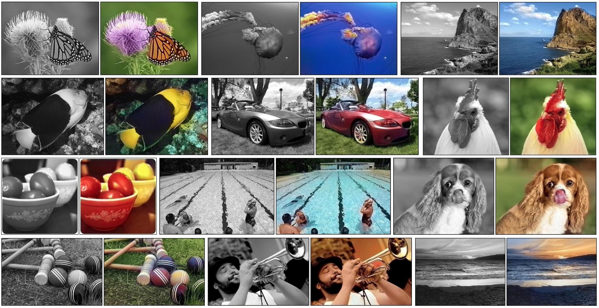
> Various colored images and their grayscale counterparts

## Problem

The problem is that this approach cannot be used for several varieties of image domains, as in the case of line-art or manga image domains (or any image domain where shading is added in the colorization process). This is the case because if we use the greyscale conversion method for colored manga or line-art, we don’t get the original image, we get the original image with the shading that was added through coloring. 

Colored line-art | The original image (what we want)  |  Greyscale version (what we get)
:-------------------------:|:-------------------------:|:-------------------------:
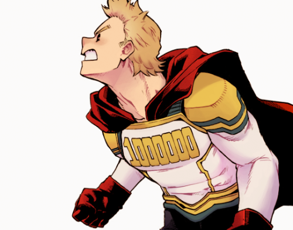  |  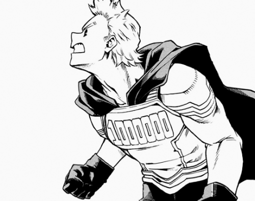 |  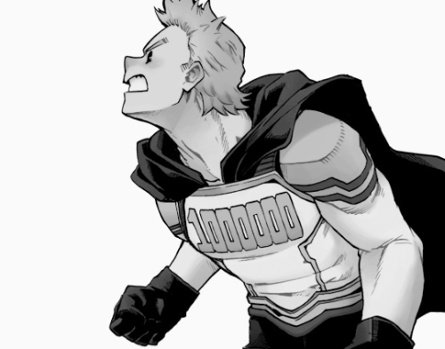
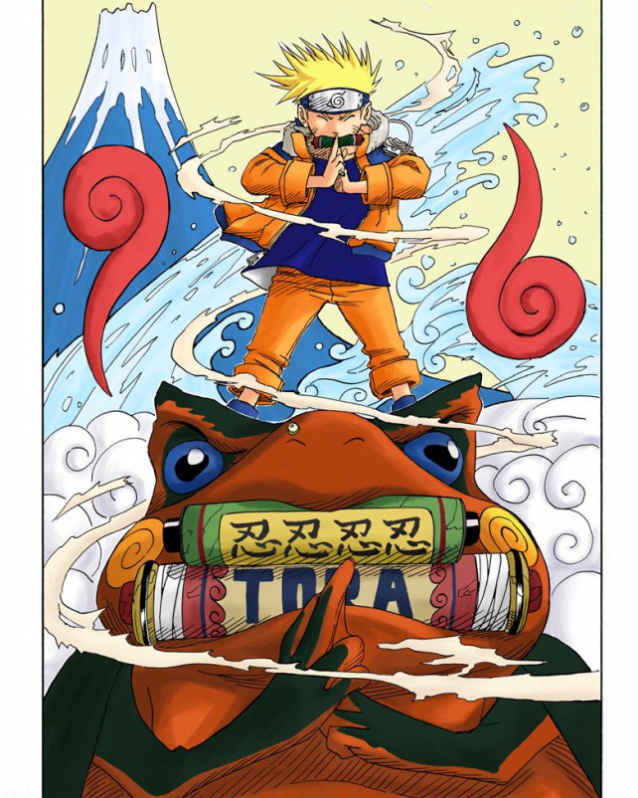  |  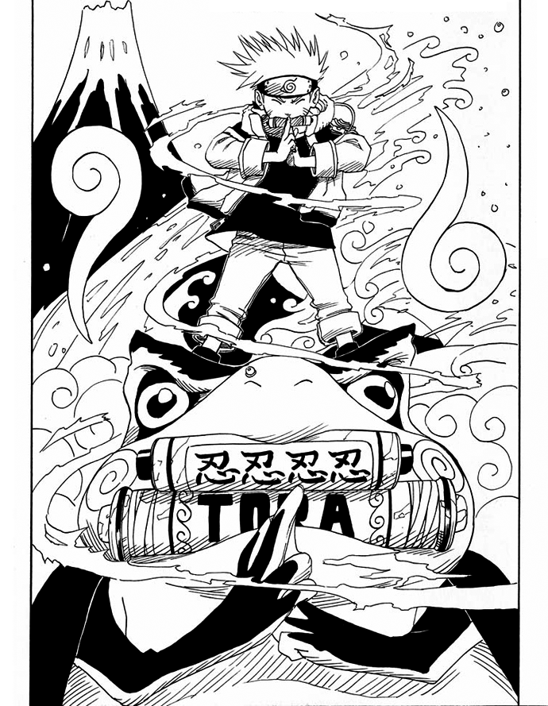 |  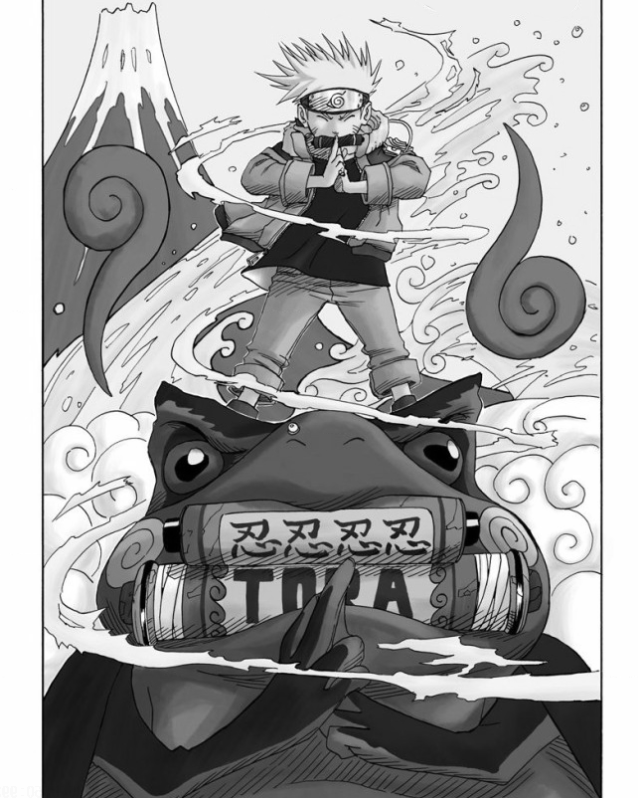
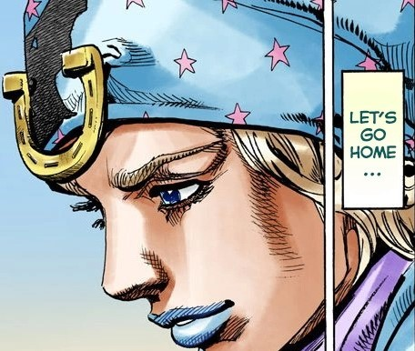  |  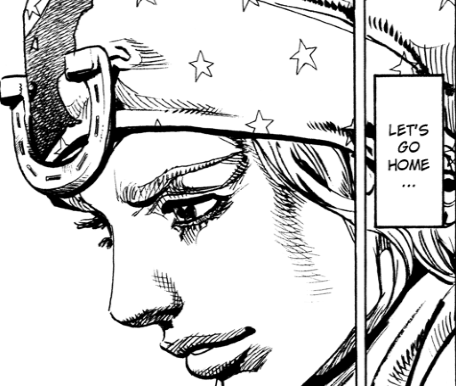 |  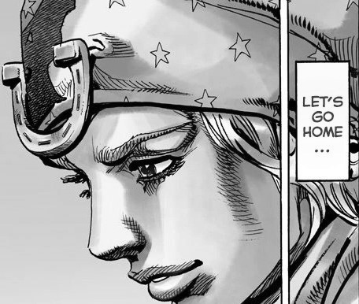

What we want is the original image itself (which we can call a 'scan' for simplicity's sake), which requires removing the added shading along with the color. This in and of itself is an ill-posed problem and roughly as complicated to solve as the colorization counterpart.

For those unaware, the reason we need the original image is because if we want to create a model with a mapping of original scan to colored images [Scan -> Color], we need to train a model with that mapping in mind. (We want to translate scans to colored versions, not greyscale conversions to colored versions.) So our training data needs to be in the form of orginal scans for our input data and the corresponding colored image as our target data.

In short, we can’t obtain paired data because the greyscale conversion method is inadequate to deal with the domain shift that happens during colorization. So what methods can we use to deal with these problems?

## Methods: Part 1

One possible method we could use to sidestep this problem is to use a separate conditional generative adversarial network (GAN or more specifically CGAN) to recreate the scan for us from the colored image. The intuition is that we use two GANs instead of one (we would be using a GAN to colorize in the first place), where the new GAN acts to produce an approximation of the original image distribution given an already colorized image.

> 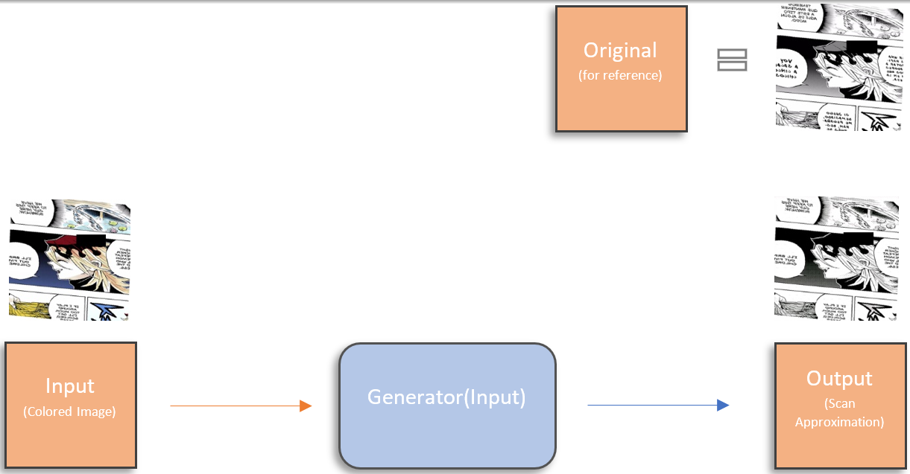
> Our proposed generator would take colored images and recreate a scan from them.

The first step is to formulate the GAN that translates a colored image to a scan. Many unpaired image-to-image translation techniques exist, but an old and relatively popular one takes the form of a CycleGAN[^1], which consists of two GANs training in parallel with the constraint of a cycle-consistency loss along with the adversarial loss that already exists for each GAN.

The two GANs in the CycleGAN meta-architecture are the scan generator and the color generator: one that generates scans from colored images, and one that generates colored images from scans. Given a set of scans and a set of colored images, the scan generator will produce what it thinks is a good approximation of a scan based on the colored input. This approximation will be sent over to the color generator, which will produce what it thinks is a good approximation of a colorized version based on the scan input. The colorized approximation of the scan approximation is compared to the original colored image. If these images differ too much the model is penalized; this is the basis of the cycle-consistency loss idea. The process is repeated but a scan is given to the color generator instead of vice versa. (The standard adversarial loss is used as well in this process.)

> 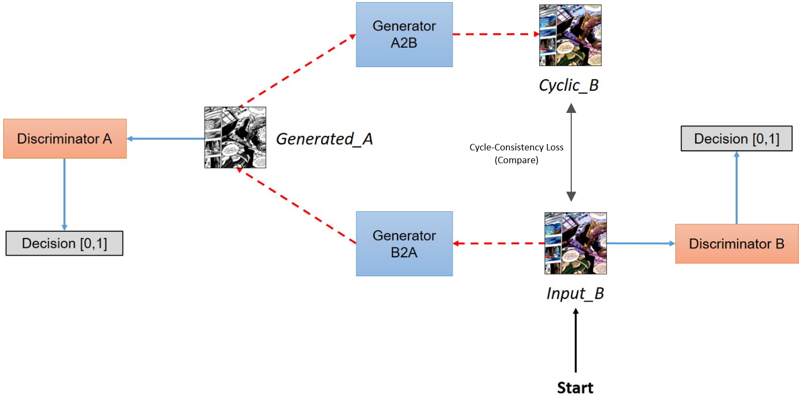
> [Real coloring] -> [Generated scan] -> [Generated coloring from generated scan]
>
> 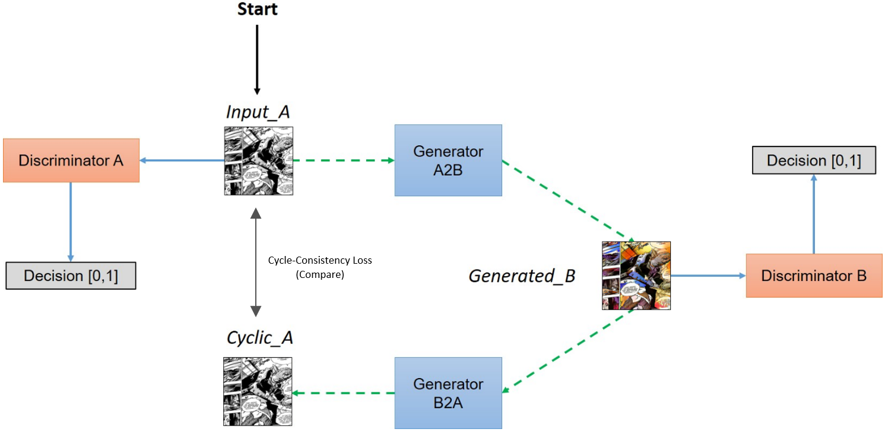
> [Real scan] -> [Generated coloring] -> [Generated scan from generated coloring]

We purposefully make a color generator that is very weak in terms of architecture (that is, a model that is not very complex), as our primary objective at this point is to establish a good scan generator. The color generator need not be a good one at this point, we just need it to output various colorings, even if they are bad colorings. The color generator pumps out flawed colorings of objects and sends them over to the scan generator. I purposefully make the scan generator relatively weak as well, the intuition being that a scan generator shouldn’t need to account for very much to be a decent “greyscale + de-shader” approximator (for example, I don’t want inference time being wasted on the generator recognizing objects that should be de-shaded more vigorously, although this could be pursued). Through the course of training, the scan generator converges, and we have a model that can take colored images and convert them to a rough scan. (All architectures are modified versions of the default CycleGAN generator/discriminator.)

Original (Real) Scan | Generated Scan (from real coloring)
:-------------------------:|:-------------------------:
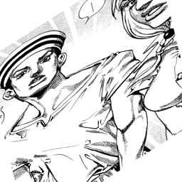  |  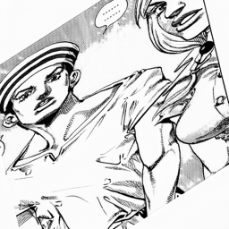
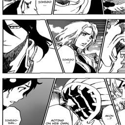  |  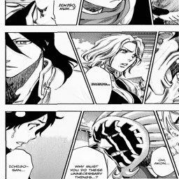
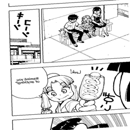  |  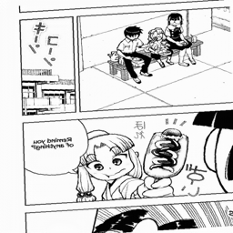
  |  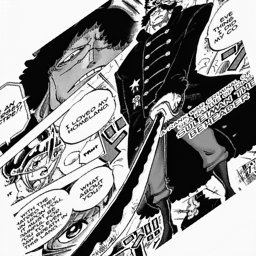
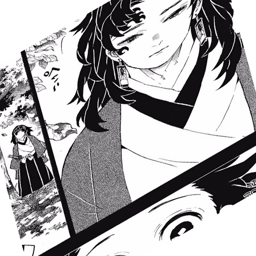  |  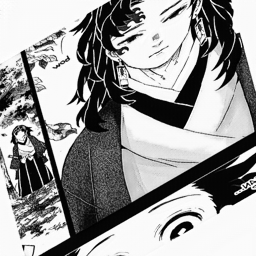

Now that we have our scan generator, given any colored image in the domain of the training data (line-art/manga images) we have a scan counterpart, and therefore we have paired data for this domain, even if it isn’t perfect.

## Methods: Part 2

Now we can focus on our colorization model: the generator that will take our recreated scans and produce the best approximation of a colorization.

We know we want to use a conditional GAN here, but we probably also want to incorporate information at different levels of analysis from the encoded input image into the decoded colorized image somehow. The intuition here is that we know that whatever plausible colorization the generator may produce, that colorization will just be the scan with some coloring and shading applied. So we want to transfer some knowledge from the process where the scan is encoded to the process where the output image is decoded.

> 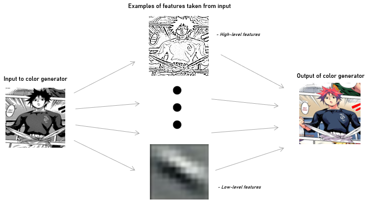
> 
> We want to be able to give our generator access to these high-level features to help the process along.

This can be accomplished this with a U-net[^2], which is a simple encoder-decoder architecture with the added characteristic that it shares encoded output feature vectors with the decoder. Technically, the outputted feature maps from various encoder layers are concatenated with the outputted feature maps of decoder layers of the same output shape.

> 
> 
> The U-net architecture as proposed in its original paper: "U-Net: Convolutional Networks for Biomedical Image Segmentation"

With this approach, our model has a better idea of what to replicate consistently in its output. This is reflected in training, where the model takes substantially fewer iterations to learn that the outline portrayed in the scan should always be recreated in the output image.

> Comparison pictures below will be slightly different due to 1) the data augmentation process used during training and 2) the semi-paired nature of the comparison pictures (for instance, pictures are from the same manga series but have different translations, watermarks, stylings, etc.)

> Regardless, they give a sense of the utility of using a U-net to facilitate the sharing of high-level information.

| Iteration | Real scan | Generated scan (before U-net) | Real Scan | Generated Scan (after U-net) |
| :-------------------------:|:-------------------------:|:-------------------------:|:-------------------------:|:-------------------------:|
| 250 | 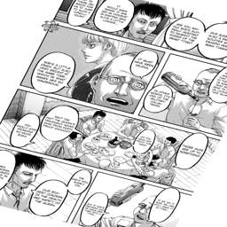  |  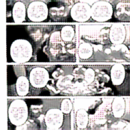 |  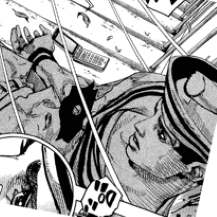 | 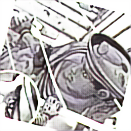 |
| 500 | 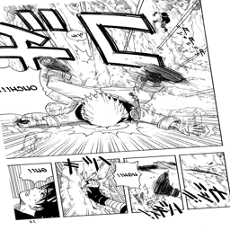  |  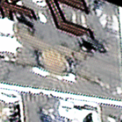 |  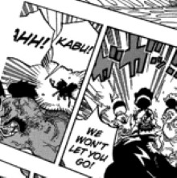 | 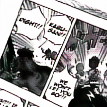 |
| 1000 | 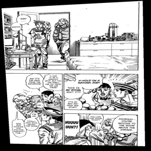  |  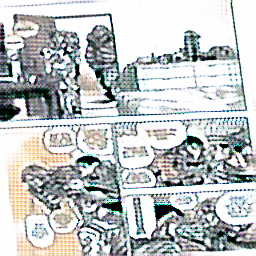 |  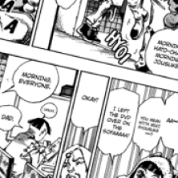 | 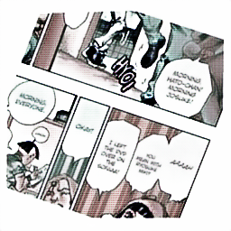 |
| 2000 | 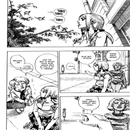 |  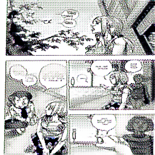 |  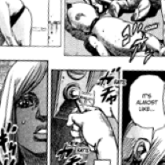 | 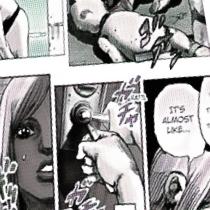 |
| 5000 | 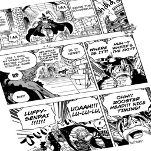 |  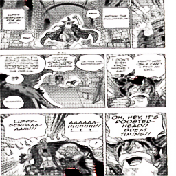 |  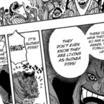 | 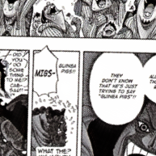 |

In image generation and colorization problems alike, it has been shown that incorporating some type of attention mechanism allows a model to explore specific and more important features in an image when trying to approximate some image distribution.

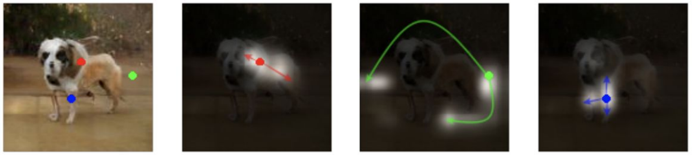
> Self-attention in generative adversarial networks allows this model to attend to the difference between dog legs and scenery, resulting in a generated dog that is not missing

In this case, for the generator and discriminator alike, three self-attention layers are subsequently appended to layers where the feature maps are largest (for the generator it's only the output maps)[^3]. Simple self-attention is used in contrast to the pooled self-attention proposed in the SAGAN paper[^4].

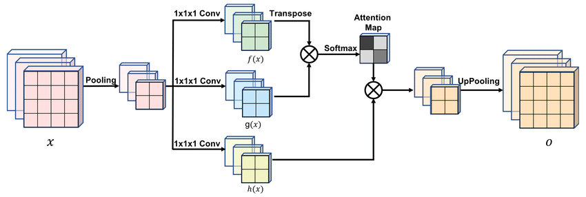
> Summary of the self-attention technique as expressed in the original paper.

For upscaling in the decoder portion of the U-net, the pixel shuffle technique with convolution is used in lieu of both up sampling with convolution and deconvolution[^5].

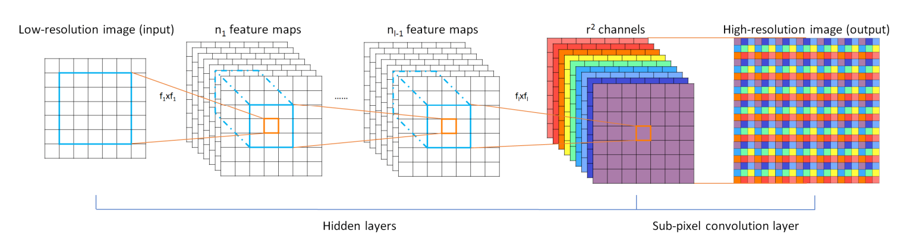
> Summary of the pixel shuffle technique as expressed in the original paper.

The U-net architecture is also modified, resulting in the final architecture used:

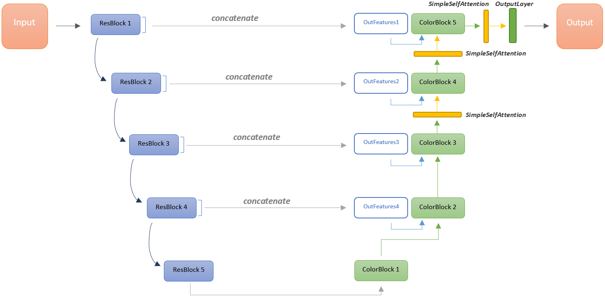

With the architecure in place, the null weights of the encoder are replaced by those from a ResNet50 classification model trained on the Danbooru2018 dataset[^6], which then are frozen. This allows for significantly faster training and reduced memory consumption since we only need to train the decoder, while enabling our Unet to encode line-art-style images accurately.

A PatchGAN is used as the discriminator that is paired with our new generator[^7]. Instead of taking information from the entire image and evaluating whether the image is real or fake in its totality as a regular discriminator would, a PatchGAN takes patches of a given image and evaluates each individual patch as real or fake and gives the average of all evaluations as output.

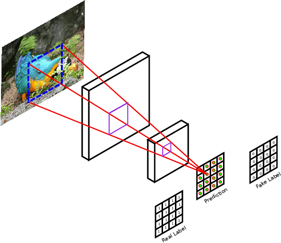

The final pipeline of the method is as follows:

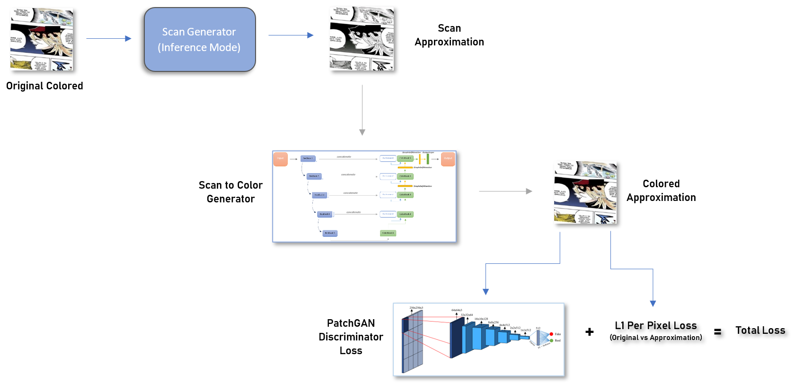

## Training
### Data

Around 340,000 specifically tagged images were taken from the Danbooru2020 dataset and used as training data[^8]. Images were filtered by tags to bound the data. No test set is used as there are not reliable algorithmic metrics for evaluating results in colorization problems. Instead, every 250 iterations the scan approximation, the colorized image, and the ground truth are saved to disk for visual evaluation.

A data augmentation pipeline of flips, slight rotations, gaussian blurring, random erasing, perspective shifts, and smart random crops (minimal crops of the image based on its height and width) are used to prevent overfitting when training for long periods, as the model has many parameters.

### Hyperparameters and Method

As mentioned in the SAGAN paper a two-timescale update rule is adapted, with the discriminator and generator learning rate initially set to 0.0004 and 0.0001 respectively. Halfway through train the learning rate for both models is set to decay linearly and the model was trained for 20 epochs per stage.

The model is trained in stages, where each stage denotes the size of the images given to the model to learn. In the first stage the model is given 64x64 images. Every stage after this the model is given images twice as big in each dimension (64x64 -> 128x128 -> 256x256). (Model training is at 128x128 images at the moment, as this project was postponed in favor of focusing on coursework.)

## Some results (so far; 128x128 images)
Scan Approximation | Original Coloring | Colored Approximation
:-------------------------:|:-------------------------:|:-------------------------:
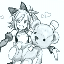  |   |  
  |   |  
  |   |  
  |   |  
  |   |  
  |   |  
  |   |  
  |   |  

## Experimentation and Failed Approaches
### Data
There were many ideas I explored and papers I read before I finally settled on the approach above. In the beginning alot of time was spent gathering actual paired data, which in hindsight is an impossible task, as the amount of colorings needed to train a large model simply don't exist (to my knowledge). Most of this gathered data was only "semi-paired" (the same save for differences in borders, watermarks, different translations of text, variations in noise, etc). Future work could involve solving problems where otherwise paired image data differs as such.

### Model/methodological approaches
A Wasserstein GAN with gradient penalty was one of the more promising approaches in terms of the model, but performance stagnated compared to the model emulated in the SAGAN paper[^9]. This is an anomaly I would like to get to the bottom of, as WGANs seem preferable theoretically.

Pondered and/or attempted approaches involved:
- Memopainter (attempted)
- ChromaGAN
- Instance-aware colorization
- Pix2Pix on semi-paired data (attemped)
- Pure CycleGAN approach on semi-paired data (attempted)
- Independently making a ResNet backbone encoder through segmentation models
- Implementation of feature loss through a pretrained ResNet50 (attempted)
- Pretraining an encoder through deep clustering of unsupervised randomly cropped images in manga domains.
- Utilizing a fusion model that incorporates ResNets pretrained on ImageNet with a separate line-art colorization model
- Different colorization loss ideas

## Limitations and possible future work
There are many areas that can be improved here:
- A proper custom backbone for the encoder of the main generator.
- I think the training domain here is too broad (the images trained on are from many different categories in terms of content).
- Making a better and more polished scan generator.
- Replacing the per-pixel loss with some kind of structure loss (maybe using per-pixel loss on edge-detected versions of the images). A blanket L1 loss works against colorful expression from the generator. This could also be addressed by linearly decreasing the impact of the per-pixel loss (minimizing lambda) as the model trains. But in doing this we run into questions surrounding whether the discriminator is strong enough to act as the sole loss function, which is why the WGAN approach is so appealing (one cannot make the discriminator too complex in a non-WGAN framework without the generator failing).
- As expressed above, a WGAN implementation.
- [...more here, there are many more limitations that should be addressed]

Future work, hopefully completed soon, includes training the model on higher resolution images and using the NoGAN approach as a substitute for linearly decaying the L1 loss.

## References
[^1]: [Unpaired Image-to-Image Translation using Cycle-Consistent Adversarial Networks](https://arxiv.org/abs/1703.10593)
[^2]: [U-Net: Convolutional Networks for Biomedical Image Segmentation](https://arxiv.org/abs/1505.04597)
[^3]: [Self-Attention Generative Adversarial Networks](https://arxiv.org/abs/1805.08318)
[^4]: [SimpleSelfAttention](https://github.com/sdoria/SimpleSelfAttention)
[^5]: [Real-Time Single Image and Video Super-Resolution Using an Efficient Sub-Pixel Convolutional Neural Network](https://arxiv.org/abs/1609.05158v2)
[^6]: [Pytorch pretrained resnet models for Danbooru2018](https://github.com/RF5/danbooru-pretrained)
[^7]: [Image-to-Image Translation with Conditional Adversarial Networks](https://arxiv.org/abs/1611.07004)
[^8]: [Danbooru2020: A Large-Scale Crowdsourced and Tagged Anime Illustration Dataset](https://www.gwern.net/Danbooru2020)
[^9]: [Improved Training of Wasserstein GANs](https://arxiv.org/abs/1704.00028)

