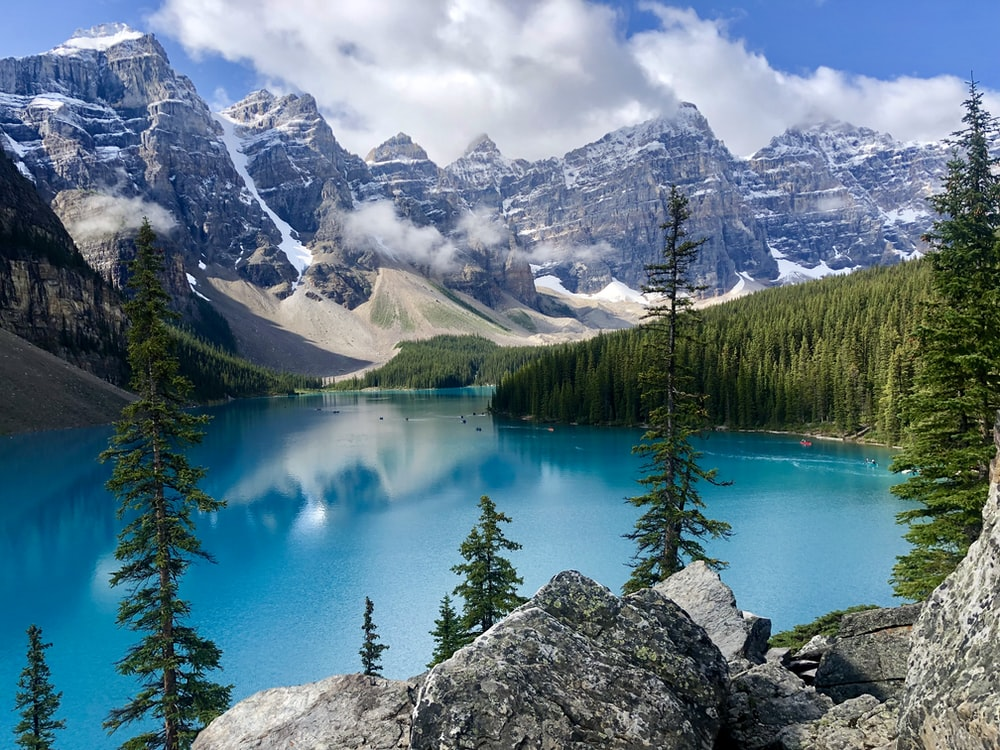
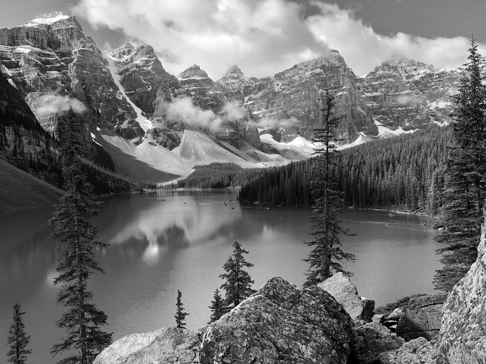

# OnePunchGAN
 
(The original project intention was a colorization model for a specific manga series, but this couldn’t be completed in a reasonable amount of time. The result up to this point is a project in itself and I'll be updating this repo with additions that move towards the goal of the original vision.)

Much of the work in the area of image colorization through neural networks is based around gathering training data by converting colored images to greyscale. But in various other image domains, such as manga or line-art, the colored images cannot be converted to the original no-color image via simple greyscale conversion, as shading (the L channel in the case of a LAB color space) may be added to the image in the coloring process by the artist. In most cases, the original no-color image is different from a greyscale conversion of the artist's coloring.

This project explores how we might go about designing a colorization model given that 1) we must work with unpaired data, as procuring a paired training dataset through the usual means is not possible, and 2) there is an added complexity that our model must perform some sort of shading task as well as the colorization task.

## Background

Much of the associated research, tutorials, and projects on colorization are predicated on learning the relationship between a particular color combination (usually the A and B channels from the LAB color space) and the lightness channel of the original image.

This is an exceedingly common practice due to the type of data most commonly used in colorization problems, which comes in the form of greyscale pictures. To obtain a training dataset that can be used to train a colorization network, one need merely obtain some large number RGB pictures from a dataset like ImageNet and convert these images to a greyscale format. This greyscale format is essentially an encoding for the shading of the image.

Original color image           |  Greyscale version (L channel only)
:-------------------------:|:-------------------------:
  |  

In practice this is a great way to gather training data, as pictures taken in greyscale (such as pictures from before color photography was widespread) and pictures converted to greyscale from color share the same domain space. In other words, an image taken by non-color photography and the same image but in color which is then converted to greyscale are the same image. The training data then consists of a converted-to-greyscale version as model input, and the original colored version as the target for the model to predict.

> 
> Various colored images and their grayscale counterparts

## Problem

The problem is that this approach cannot be used for several varieties of image domains, as in the case of line-art or manga image domains (or any image domain where shading is added in the colorization process). This is the case because if we use the greyscale conversion method for colored manga or line-art, we don’t get the original image, we get the original image with the shading that was added through coloring. 

Colored line-art | The original image (what we want)  |  Greyscale version (what we get)
:-------------------------:|:-------------------------:|:-------------------------:
  |   |  
  |   |  
  |   |  

What we want is the original image itself (which we can call a 'scan' for simplicity's sake), which requires removing the added shading along with the color. This in and of itself is an ill-posed problem and roughly as complicated to solve as the colorization counterpart.

For those unaware, the reason we need the original image is because if we want to create a model with a mapping of original scan to colored images [Scan -> Color], we need to train a model with that mapping in mind. (We want to translate scans to colorings versions, not greyscale conversions to colorings.) So our training data needs to be in the form of orginal scans for our input data and the corresponding colored image as our target data.

In short, we can’t obtain paired data because the greyscale conversion method is inadequate to deal with the domain shift that happens during colorization. So what methods can we use to deal with these problems?

[Pictures to explain how to get to original]

## Methods Part 1

One possible method we could use to sidestep this problem is to use a separate conditional generative adversarial network (GAN or more specifically CGAN) to recreate the original image for us from the colored image. The intuition is that we use two GANs instead of one (we would be using a GAN to colorize in the first place), where the new GAN acts to produce an approximation of the original image distribution given an already colorized image.

[images]

The first step is to formulate the generator that translates a colored image to a scan. Many unpaired image-to-image translation techniques exist, but an old and relatively popular one takes the form of a CycleGAN, which consists of two GANs training in parallel with the constraint of a cycle-consistency loss along with the adversarial loss that already exists for each GAN.

[CycleGAN architecture and images]

The two GANs in the CycleGAN meta-architecture are the scan generator and the color generator: one that generates scans from colored images, and one that generates colored images from scans. Given a set of scans and a set of colored images, the scan generator will produce what it thinks is a good approximation of a scan based on the colored input. This approximation will be sent over to the color generator, which will produce what it thinks is a good approximation of a colorized version based on the scan input. The colorized approximation of the scan approximation is compared to the original colored image. If these images differ too much the model is penalized; this is the basis of the cycle-consistency loss idea. The process is repeated but a scan is given to the color generator instead of vice versa. (The standard adversarial loss is used as well in this process.)

[process]

We purposefully make a color generator that is very weak in terms of architecture (that is, a model that is not very complex), as our plan is to establish a good scan generator. The color generator pumps out flawed colorings of objects and sends them over to the scan generator. I purposefully make the scan generator relatively weak as well, the intuition being that a scan generator shouldn’t need to account for very much to be a good “greyscale + de-shader” approximator (for example, I don’t want inference time being wasted on the generator recognizing objects that should be de-shaded more vigorously). Through the course of training, the scan generator converges, and we have a model that can take colored images and convert them to a rough scan.

[scans from scan generator]

Now that we have our scan generator, given any colored image in the domain of the training data (line-art/manga images) we have a scan counterpart, and therefore we have paired data for this domain, even if it isn’t perfect.

## Methods Part 2

Now we can focus on our colorization model: the generator that will take our recreated scans and produce the best approximation of a colorization.

We know we want to use a conditional GAN here, but we probably also want to incorporate information from the encoded input image into the decoded colorized image somehow. The intuition here is that we know that whatever plausible colorization the generator may produce, that colorization will just be the scan with some coloring and shading applied. So we want to transfer some knowledge from the process where the scan is encoded to the process where the output image is decoded.

[transfer knowledge idea]

This can be accomplished this with a U-net, which is a simple encoder-decoder architecture with the added characteristic that it shares encoded output feature vectors with the decoder. Technically, the outputted feature maps from various encoder layers are concatenated with the outputted feature maps of decoder layers of the same output shape.

[Unet idea]

With this approach, our model has a better idea of what to replicate consistently in its output. This is reflected in training, where the model takes substantially fewer iterations to learn that the outline portrayed in the scan should always be recreated in the output image.

[do we have images of this?]

In image generation and colorization problems alike, it has been shown that incorporating some type of attention mechanism allows a model to explore specific and more important features in an image when trying to approximate some image distribution.

[attention]

In this case, for the generator and discriminator alike, three self-attention layers are subsequently appended to layers where the feature maps are largest. Simple self-attention (based on [x]) is used in contrast to the pooled self-attention proposed in the [SAGAN] paper.

[links to all above]
[self attention layers]

For upscaling in the decoder portion of the U-net, the pixel shuffle technique with convolution is used in lieu of both up sampling with convolution and deconvolution.

[pixel shuffle]

The U-net architecture is also modified, resulting in the final architecture used:

[architecture used]

A PatchGAN, introduced by the Pix2Pix model in [xxx], is used as the discriminator that is paired with our new generator. Instead of taking information from the entire image and evaluating whether the image is real or fake in its totality as a regular discriminator would, a PatchGAN takes patches of a given image and evaluates each individual patch as real or fake and gives the average of all evaluations as output.

[PatchGAN]

The general pipeline of the method is as follows:

[colored image -> scangen(CL) -> colorGAN(scangen(CL))]

## Training

### Data

Around 340,000 specifically tagged images were taken from the [Danbooru2020 dataset] and used as training data. Tags are selected to bound the data within a reasonable domain. No test set is used as there do not seem to be reliable algorithmic metrics for colorization problems. Instead, every 250 iterations the scan approximation, the colorized image, and the ground truth are saved to disk for visual evaluation.

### Hyperparameters and Method

[images representing this]

## Results (so far)

[Images so far, sorted by image size and epoch, etc; points of failure]

## Experimentation and Failed Approaches

## Conclusions (any more to add?)

(end with conclusion if there is not anything left of vlaue to add)
